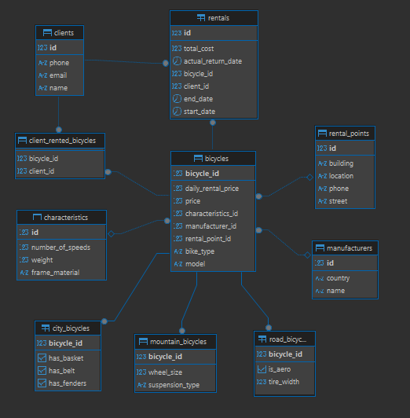

# RentalBikes

**RentalBikes** — учебное full-stack веб-приложение для управления сервисом проката велосипедов.

Пользователь может просматривать каталог велосипедов, применять фильтры, проверять доступность техники на выбранные даты и оформлять аренду. Для сотрудников проката предусмотрены просмотр бронирований и добавление новых велосипедов.

Проект объединяет клиентскую часть на **React**, REST API на **Spring Boot** и реляционную базу данных **PostgreSQL**.

> Проект представляет собой функциональный прототип и продолжает дорабатываться.

---

## Основные возможности

### Для пользователя

- просмотр каталога велосипедов;
- фильтрация по типу велосипеда;
- выбор пункта проката;
- фильтрация по стоимости аренды;
- отображение доступных и занятых велосипедов;
- просмотр характеристик каждой модели;
- выбор периода аренды через календарь;
- проверка пересечения с существующими бронированиями;
- автоматический расчёт стоимости;
- оформление аренды с указанием контактных данных.

### Для сотрудника проката

- добавление новых велосипедов;
- выбор типа велосипеда и его характеристик;
- привязка велосипеда к производителю и пункту проката;
- просмотр последних бронирований;
- фиксация возврата велосипеда;
- управление клиентами и производителями через REST API.

> Текущий административный режим является демонстрационным: пароль проверяется только в React-интерфейсе и не представляет собой полноценную систему авторизации.

---

## Технологический стек

### Клиентская часть

- **React 18**
- **React Router 6**
- JavaScript
- Create React App
- React DatePicker
- GSAP
- CSS Modules
- Fetch API

### Серверная часть

- **Java 21**
- **Spring Boot 3.2.7**
- Spring Web
- Spring Data JPA
- Hibernate
- Jakarta Persistence
- Lombok
- Maven

### Хранение данных

- **PostgreSQL**
- реляционная модель данных;
- внешние ключи и ограничения уникальности;
- наследование сущностей через стратегию `JOINED`;
- JPQL-запросы для поиска доступных велосипедов и активных аренд.

---

## Архитектура приложения

Приложение разделено на клиентскую и серверную части.

React-интерфейс отправляет HTTP-запросы к REST API. Сервер обрабатывает запросы, выполняет бизнес-правила и обращается к PostgreSQL через Spring Data JPA.

Серверная часть построена по многоуровневой архитектуре:

1. **Controllers** — принимают HTTP-запросы и формируют ответы.
2. **Services** — содержат бизнес-логику аренды, возврата и проверки доступности.
3. **Repositories** — выполняют операции с базой данных.
4. **Models** — описывают предметную область и связи между сущностями.
5. **PostgreSQL** — хранит велосипеды, клиентов, аренды и пункты проката.

```text
React-интерфейс
        │
        │ HTTP / JSON
        ▼
Spring REST Controllers
        │
        ▼
Service Layer
        │
        ▼
Spring Data JPA
        │
        ▼
PostgreSQL
```

---

## Предметная область

### Велосипеды

В системе представлены три типа велосипедов:

- горные — `MountainBicycle`;
- шоссейные — `RoadBicycle`;
- городские — `CityBicycle`.

Общие свойства вынесены в абстрактный класс `Bicycle`, а специфические характеристики определены в классах-наследниках.

Для хранения иерархии используется стратегия:

```java
@Inheritance(strategy = InheritanceType.JOINED)
@DiscriminatorColumn(name = "bike_type")
```

Общие данные хранятся в таблице `bicycles`, а свойства отдельных типов — в специализированных таблицах.

### Клиенты

Для клиента сохраняются:

- имя;
- электронная почта;
- номер телефона;
- текущие велосипеды;
- история аренд.

Если при оформлении аренды клиента с указанным номером телефона ещё нет, он автоматически создаётся.

### Аренда

Каждая аренда связывает:

- клиента;
- велосипед;
- дату начала;
- плановую дату завершения;
- фактическую дату возврата;
- итоговую стоимость.

### Пункты проката

Каждый велосипед привязан к определённому пункту проката. Для пункта сохраняются название, адрес и контактный телефон.

---

## Бизнес-логика

### Проверка доступности

Перед оформлением аренды сервер проверяет, пересекается ли выбранный период с существующими активными арендами этого велосипеда.

Период считается доступным, если он полностью расположен до начала или после окончания существующей аренды.

```java
return end.isBefore(startDate) || start.isAfter(endDate);
```

Проверка выполняется как на клиентской стороне при выборе дат, так и на серверной стороне перед сохранением аренды.

### Расчёт стоимости велосипеда

Стоимость зависит от его типа и характеристик.

Например:

- для горных велосипедов учитываются подвеска, размер колёс и страна производителя;
- для шоссейных — ширина шин и аэродинамические характеристики;
- для городских — наличие корзины, крыльев и звонка.

В расчёте также применяется коэффициент страны производителя.

### Стоимость аренды

Дневной тариф формируется на основе стоимости велосипеда:

```text
дневной тариф = 500 ₽ + 1% от стоимости велосипеда
```

Итоговая сумма зависит от продолжительности аренды. Минимальный расчётный период — один день.

### Просроченные аренды

Фоновая задача раз в час получает аренды, срок которых уже истёк, но возврат ещё не был зарегистрирован.

```java
@Scheduled(fixedRate = 3600000)
```

В текущей версии информация о таких арендах записывается в журнал приложения.

---

## Интерфейс приложения

Основной экран представляет собой каталог карточек велосипедов.

В карточке отображаются:

- тип и модель;
- производитель;
- пункт проката;
- материал рамы;
- вес;
- количество скоростей;
- специальные характеристики выбранного типа;
- стоимость аренды;
- текущая доступность.

В интерфейсе также реализованы:

- панель фильтров;
- форма выбора периода аренды;
- расчёт итоговой стоимости;
- форма добавления велосипеда;
- таблица последних бронирований;
- сообщения о загрузке и ошибках.

---

## REST API

Базовый адрес локального API:

```text
http://localhost:8080/api
```

### Велосипеды

| Метод | Endpoint | Назначение |
|---|---|---|
| `GET` | `/api/bicycles` | Получить каталог с фильтрами |
| `GET` | `/api/bicycles/available` | Получить доступные велосипеды |
| `GET` | `/api/bicycles/type/{type}` | Получить велосипеды выбранного типа |
| `GET` | `/api/bicycles/{id}` | Получить велосипед по идентификатору |
| `GET` | `/api/bicycles/{id}/active-rentals` | Получить активные аренды велосипеда |
| `GET` | `/api/bicycles/{id}/check-availability` | Проверить доступность на период |
| `POST` | `/api/bicycles` | Добавить велосипед |
| `POST` | `/api/bicycles/{id}/return` | Зарегистрировать возврат |

Для `GET /api/bicycles` поддерживаются параметры:

- `type`;
- `rentalPoint`;
- `minPrice`;
- `maxPrice`;
- `availability`;
- `startDate`;
- `endDate`.

### Аренды

| Метод | Endpoint | Назначение |
|---|---|---|
| `POST` | `/api/rentals` | Оформить аренду |
| `GET` | `/api/rentals` | Получить активные аренды |
| `GET` | `/api/rentals/{id}` | Получить аренду по идентификатору |
| `POST` | `/api/rentals/{id}/return` | Завершить аренду |

### Клиенты

| Метод | Endpoint | Назначение |
|---|---|---|
| `POST` | `/api/clients` | Создать клиента |
| `GET` | `/api/clients` | Получить список клиентов |
| `GET` | `/api/clients/{id}` | Получить клиента |

### Производители

| Метод | Endpoint | Назначение |
|---|---|---|
| `GET` | `/api/manufacturers` | Получить производителей |
| `GET` | `/api/manufacturers/{id}` | Получить производителя |
| `POST` | `/api/manufacturers` | Добавить производителя |

### Пункты проката

| Метод | Endpoint | Назначение |
|---|---|---|
| `GET` | `/api/rental-points` | Получить пункты проката |
| `GET` | `/api/rental-points/{id}` | Получить пункт проката |

---

## Модель данных

Основные таблицы:

- `bicycles` — общие данные велосипедов;
- `mountain_bicycles` — характеристики горных велосипедов;
- `road_bicycles` — характеристики шоссейных велосипедов;
- `city_bicycles` — характеристики городских велосипедов;
- `characteristics` — общие технические характеристики;
- `manufacturers` — производители;
- `rental_points` — пункты проката;
- `clients` — клиенты;
- `rentals` — история и состояние аренд;
- `client_rented_bicycles` — связь клиентов с арендованными велосипедами.

### Основные связи

- один производитель выпускает несколько велосипедов;
- каждый велосипед принадлежит одному производителю;
- каждый велосипед находится в одном пункте проката;
- каждый велосипед имеет отдельный набор характеристик;
- один клиент может оформить несколько аренд;
- каждая аренда связана с одним клиентом и одним велосипедом.



### Диаграмма классов


---

## Структура проекта

```text
src/main/
├── java/com/bikerental/
│   ├── Main.java                   # Запуск приложения и демонстрационные данные
│   ├── controllers/                # REST-контроллеры
│   ├── models/                     # JPA-сущности
│   ├── repositories/               # Репозитории Spring Data JPA
│   └── services/                   # Бизнес-логика
│
└── resources/
    ├── application.properties      # Настройки Spring Boot и PostgreSQL
    └── static/
        ├── package.json            # Зависимости React-приложения
        ├── public/                 # Публичные ресурсы
        └── src/
            ├── components/         # Компоненты и страницы
            ├── services/           # Обращение к REST API
            ├── App.js              # Маршрутизация
            └── index.js            # Точка входа React
```

---

## Локальный запуск

### Требования

- Java 21;
- Maven 3.9 или новее;
- PostgreSQL;
- Node.js 18 или новее;
- npm.

### 1. Клонирование

```bash
git clone https://github.com/Gonerr/RentalBikes.git
cd RentalBikes
```

### 2. Настройка PostgreSQL

Создайте базу данных и укажите параметры подключения в:

```text
src/main/resources/application.properties
```

Пример:

```properties
spring.datasource.url=jdbc:postgresql://localhost:5432/postgres
spring.datasource.username=postgres
spring.datasource.password=your_password
```

В текущей конфигурации используется:

```properties
spring.jpa.hibernate.ddl-auto=create-drop
```

Поэтому таблицы пересоздаются при запуске, а приложение заполняет их демонстрационными данными.

Для постоянного хранения данных режим следует заменить, например, на `update` и подключить механизм миграций.

### 3. Запуск серверной части

В корне репозитория:

```bash
mvn spring-boot:run
```

После запуска REST API будет доступен по адресу:

```text
http://localhost:8080
```

Проверка состояния:

```text
GET http://localhost:8080/api/bicycles/health
```

### 4. Запуск клиентской части

Откройте второй терминал:

```bash
cd src/main/resources/static
npm install
npx react-scripts start
```

Клиентское приложение должно быть доступно по адресу:

```text
http://localhost:3000
```

---

## Реализованные технические решения

В ходе работы над проектом были реализованы:

- full-stack-взаимодействие React и Spring Boot;
- проектирование REST API;
- многоуровневая серверная архитектура;
- моделирование предметной области через JPA-сущности;
- наследование сущностей с использованием стратегии `JOINED`;
- связи `One-to-One`, `One-to-Many`, `Many-to-One` и `Many-to-Many`;
- JPQL-запросы к базе данных;
- транзакционное оформление и завершение аренды;
- проверка пересечения временных интервалов;
- автоматический расчёт стоимости;
- фильтрация каталога по нескольким параметрам;
- фоновая проверка просроченных аренд;
- разделение интерфейса на переиспользуемые React-компоненты;
- обработка состояний загрузки и ошибок.

---

## Текущее состояние и планы развития

Проект является учебным full-stack-прототипом.

Планируемые улучшения:

- полноценная регистрация и авторизация пользователей;
- серверная проверка роли администратора;
- вынесение параметров подключения в переменные окружения;
- миграции базы данных через Flyway или Liquibase;
- добавление глобальной обработки ошибок;
- серверная валидация входных DTO;
- добавление модульных и интеграционных тестов;
- исправление и завершение экспериментальной главной страницы;
- объединение конфигурации адреса API в одном модуле;
- контейнеризация приложения через Docker;
- подготовка production-сборки React-интерфейса.

---

## Автор

**Анастасия Лихачева**

Проект разработан в качестве самостоятельной учебной работы для практического изучения Java, объектно-ориентированного программирования, Spring Boot, React и проектирования реляционных баз данных.
