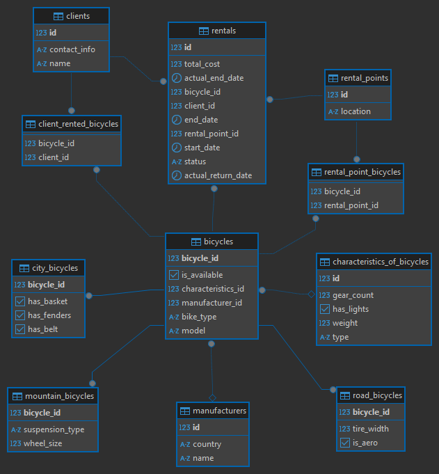

# BikeRental_Service

Сервис для аренды велосипедов

<a name="overview"></a>
## 1. Обзор системы

Система управления прокатом велосипедов представляет собой RESTful веб-сервис, реализующий:

- Многоуровневую архитектуру (Controller-Service-Repository)
- Наследование сущностей с стратегией `JOINED`
- Сложные бизнес-правила аренды
- Автоматическую обработку просроченных аренд

**Ключевые технологии**:
- Spring Boot 3.2
- Hibernate 6.4
- Lombok
- PostgreSQL

## 2. Функционал сервиса

**Сервис позволяет**:
- Арендовать и возвращать велосипеды
- Управлять клиентами, пунктами проката и велосипедами
- Просматривать активные и завершенные аренды

Основные сущности:
2.1. *Велосипеды (Bicycles)*
- Типы велосипедов: Горные, шоссейные, городские (наследование через @Inheritance)
- Характеристики: Вес, количество скоростей, наличие фар и т.д.
- Доступность: Проверка статуса (isAvailable)

Endpoints:
- GET /api/bicycles – список всех велосипедов
- GET /api/bicycles/available – доступные для аренды
- GET /api/bicycles/{id} – информация о конкретном велосипеде

2.2. *Клиенты (Clients)*
- Регистрация клиентов с контактными данными
- История аренд

Endpoints:
- POST /api/clients – создать клиента
- GET /api/clients/{id} – информация о клиенте

2.3. *Пункты проката (RentalPoints)*
- Добавление/удаление велосипедов в пункте
- Просмотр доступных велосипедов

Endpoints:
- GET /api/rentalPoints – список всех пунктов

2.4. *Аренда (Rentals)*
- Создание аренды: Клиент + велосипед + срок
- Автоматическое завершение: Проверка просроченных аренд (по endDate)
- Ручное завершение: Возврат велосипеда

Endpoints:
- POST /api/rentals/rent – начать аренду
- POST /api/rentals/{id}/return – завершить аренду
- GET /api/rentals/active – активные аренды


## 3. Архитектурные решения

### 3.1 Наследование сущностей
```java
@Entity
@Inheritance(strategy = InheritanceType.JOINED)
@DiscriminatorColumn(name = "bike_type")
public abstract class Bicycle {
    // Базовые поля
}

@Entity
@DiscriminatorValue("MOUNTAIN")
public class MountainBicycle extends Bicycle {
    private String suspensionType;
    private double wheelSize;
}

@Entity
@DiscriminatorValue("ROAD") 
public class RoadBicycle extends Bicycle {
    private double tireWidth;
    private boolean isAero;
}
```
## 4. База данных

## Диаграмма структуры БД
### 

## Описание таблиц

### Основные сущности

1. **clients** - информация о клиентах:
    - `id` (PK) - идентификатор клиента
    - `name` - имя клиента
    - `contact_info` - контактные данные

2. **bicycles** - велосипеды:
    - `bicycle_id` (PK) - идентификатор велосипеда
    - `model` - модель велосипеда
    - `bike_type` - тип велосипеда (городской, горный и т.д.)
    - `is_available` - доступен ли для аренды
    - Связи с manufacturer и characteristics

3. **manufacturers** - производители:
    - `id` (PK)
    - `name` - название производителя
    - `country` - страна производства

### Специализированные таблицы велосипедов

4. **city_bicycles** - характеристики городских велосипедов:
    - Наличие корзины (`has_basket`)
    - Наличие крыльев (`has_fenders`)
    - Тип привода (`has_belt`)

5. **mountain_bicycles** - горные велосипеды:
    - Тип подвески (`suspension_type`)
    - Размер колес (`wheel_size`)

6. **road_bicycles** - шоссейные велосипеды:
    - Ширина покрышек (`tire_width`)
    - Аэродинамическая конструкция (`is_aero`)

### Аренда

7. **rental_points** - пункты проката:
    - `id` (PK)
    - `location` - местоположение

8. **rentals** - информация об аренде:
    - `id` (PK)
    - `client_id` (FK) - клиент
    - `bicycle_id` (FK) - велосипед
    - `rental_point_id` (FK) - пункт выдачи
    - Даты аренды (`start_date`, `end_date`)
    - Фактические даты (`actual_end_date`, `actual_return_date`)
    - Стоимость (`total_cost`)
    - Статус (`status`)

### Вспомогательные таблицы

9. **characteristics_of_bicycles** - технические характеристики:
    - Количество передач (`gear_count`)
    - Наличие фар (`has_lights`)
    - Вес (`weight`)
    - Тип (`type`)

10. **client_rented_bicycles** - связь клиентов и арендованных велосипедов (many-to-many)
11. **rental_point_bicycles** - связь пунктов проката и велосипедов (many-to-many)

## Ключевые связи
- Клиент может арендовать несколько велосипедов (через таблицу `client_rented_bicycles`)
- Каждый велосипед принадлежит определенному производителю (`manufacturer_id`)
- Аренда всегда привязана к пункту проката (`rental_point_id`)